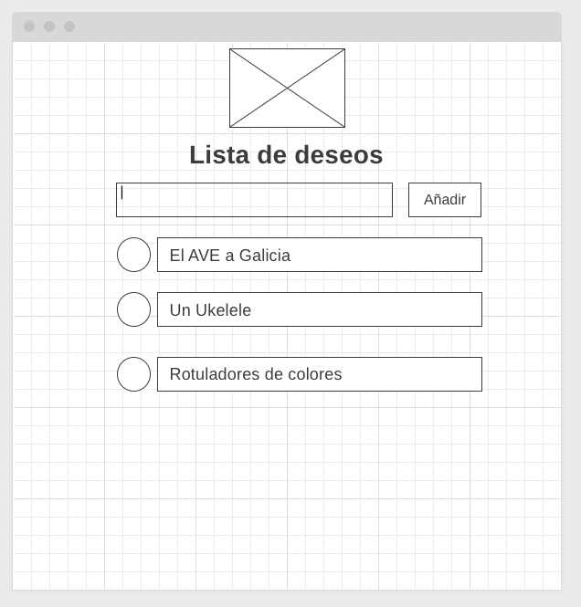

## Enunciado:
La Navidad se acerca y Papa Noel aún no tiene claro qué tiene que comprar. Ayúdale creando una lista de deseos utilizando los componentes de material-ui. La funcionalidad básica es tener un input para introducir cada deseo y una lista para mostrar todo lo que se ha introducido. Hazlo lo más simple posible. Si se te ocurren otras funcionalidades, puedes añadirlas. Debería ser un ejercicio rápido y sencillo, sin demasiados detalles de maquetación. No debería llevarte más de 4-6 horas y no necesitas conectar con ninguna API. Si ves que te atascas, puedes preguntar sin ningún problema. Te acompañamos un wireframe para que te hagas una idea de lo que necesita.

; 